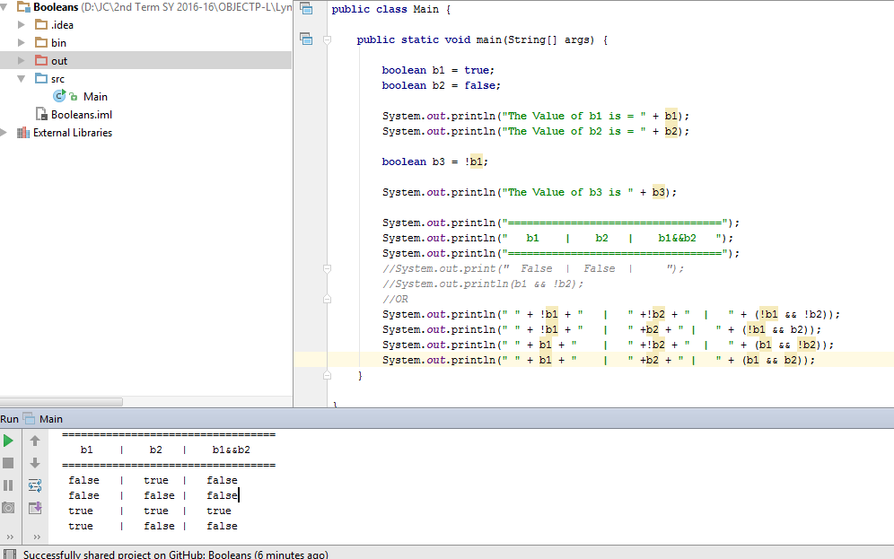

# Booleans

~~~
public class Main {

	public static void main(String[] args) {

		boolean p = true;
		boolean q = false;

		System.out.println("The Value of p is = " + p);
        System.out.println("The Value of q is = " + q);

        boolean r = !p;

        System.out.println("The Value of r is " + r);

        System.out.println(".            AND Table            .");
        System.out.println("==================================");
        System.out.println("   p    |    q   |    p&&q   ");
        System.out.println("==================================");
        //System.out.print("  False  |  False  |     ");
        //System.out.println(b1 && !b2);
        //OR
        System.out.println(" " + !p + "   |   " +!q + "  |   " + (!p && !q));
        System.out.println(" " + !p + "   |   " +q + " |   " + (!p && q));
        System.out.println(" " + p + "    |   " +!q + "  |   " + (p && !q));
        System.out.println(" " + p + "    |   " +q + " |   " + (p && q));

        System.out.println(".            NAND Table            .");
        System.out.println("==================================");
        System.out.println("   p    |    q   |    p&&q   ");
        System.out.println("==================================");
        //System.out.print("  False  |  False  |     ");
        //System.out.println(b1 && !b2);
        //OR
        System.out.println(" " + !p + "   |   " +!q + "  |   " + (p && !q));
        System.out.println(" " + !p + "   |   " +q + " |   " + (p && !q));
        System.out.println(" " + p + "    |   " +!q + "  |   " + (!p && !q));
        System.out.println(" " + p + "    |   " +q + " |   " + (p && !q));

        System.out.println(".            OR Table            .");
        System.out.println("==================================");
        System.out.println("   p    |    q   |    p&&q   ");
        System.out.println("==================================");
        //System.out.print("  False  |  False  |     ");
        //System.out.println(b1 && !b2);
        //OR
        System.out.println(" " + !p + "   |   " +!q + "  |   " + (p && !q));
        System.out.println(" " + !p + "   |   " +q + " |   " + (!p && !q));
        System.out.println(" " + p + "    |   " +!q + "  |   " + (p && !q));
        System.out.println(" " + p + "    |   " +q + " |   " + (p && !q));

        System.out.println(".            NOR Table            .");
        System.out.println("==================================");
        System.out.println("   p    |    q   |    p&&q   ");
        System.out.println("==================================");
        //System.out.print("  False  |  False  |     ");
        //System.out.println(b1 && !b2);
        //OR
        System.out.println(" " + !p + "   |   " +!q + "  |   " + (!p && !q));
        System.out.println(" " + !p + "   |   " +q + " |   " + (p && !q));
        System.out.println(" " + p + "    |   " +!q + "  |   " + (!p && !q));
        System.out.println(" " + p + "    |   " +q + " |   " + (p && q));

        System.out.println(".            OR Table            .");
        System.out.println("==================================");
        System.out.println("   p    |    q   |    p&&q   ");
        System.out.println("==================================");
        //System.out.print("  False  |  False  |     ");
        //System.out.println(b1 && !b2);
        //OR
        System.out.println(" " + !p + "   |   " +!q + "  |   " + (!p && !q));
        System.out.println(" " + !p + "   |   " +q + " |   " + (!p && q));
        System.out.println(" " + p + "    |   " +!q + "  |   " + (p && !q));
        System.out.println(" " + p + "    |   " +q + " |   " + (p && q));

        System.out.println(".            XOR Table            .");
        System.out.println("==================================");
        System.out.println("   p    |    q   |    p&&q   ");
        System.out.println("==================================");
        //System.out.print("  False  |  False  |     ");
        //System.out.println(b1 && !b2);
        //OR
        System.out.println(" " + !p + "   |   " +!q + "  |   " + (p ^ q));
        System.out.println(" " + !p + "   |   " +q + " |   " + (p ^ !q));
        System.out.println(" " + p + "    |   " +!q + "  |   " + (p ^ !q));
        System.out.println(" " + p + "    |   " +q + " |   " + (p ^ q));

        System.out.println(".            XNOR Table            .");
        System.out.println("==================================");
        System.out.println("   p    |    q   |    p&&q   ");
        System.out.println("==================================");
        //System.out.print("  False  |  False  |     ");
        //System.out.println(b1 && !b2);
        //OR
        System.out.println(" " + !p + "   |   " +!q + "  |   " + !(p ^ q));
        System.out.println(" " + !p + "   |   " +q + " |   " + !(p ^ !q));
        System.out.println(" " + p + "    |   " +!q + "  |   " + !(p ^ !q));
        System.out.println(" " + p + "    |   " +q + " |   " + !(p ^ q));

    }

}
~~~
